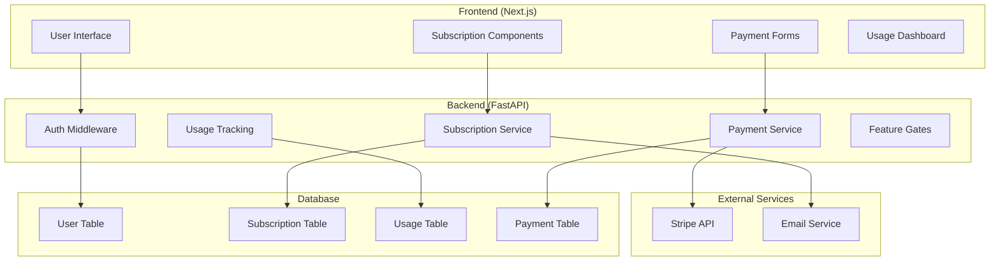

# Design Document

## Overview

The subscription service will be implemented as a comprehensive system that integrates with the existing FastAPI backend and Next.js frontend. The design leverages the current user authentication system and extends it with subscription management, payment processing, and feature access control. The system will use Stripe for payment processing and implement a middleware-based approach for feature gating.

Key design principles:
- Seamless integration with existing authentication flow
- Graceful degradation for Free users
- Real-time subscription status validation
- Secure payment processing with PCI compliance
- Scalable usage tracking and analytics

## Architecture

### High-Level Architecture



### Data Flow

1. **User Registration**: New users automatically get Free tier access
2. **Feature Access**: Middleware checks subscription status before processing requests
3. **Usage Tracking**: Each resume processing increments usage counters
4. **Subscription Management**: Stripe webhooks update subscription status
5. **Payment Processing**: Secure tokenized payments through Stripe
6. **Analytics**: Real-time dashboard updates based on usage data

## Components and Interfaces

### Backend Components

#### 1. Enhanced User Model
Extends the existing User model with subscription-specific fields:

```python
class User(Base):
    # Existing fields...
    
    # Enhanced subscription fields
    subscription_tier = Column(Enum(SubscriptionTier), default=SubscriptionTier.FREE)
    stripe_customer_id = Column(String(255), nullable=True, index=True)
    subscription_status = Column(Enum(SubscriptionStatus), default=SubscriptionStatus.ACTIVE)
    current_period_start = Column(DateTime, nullable=True)
    current_period_end = Column(DateTime, nullable=True)
    cancel_at_period_end = Column(Boolean, default=False)
    
    # Usage tracking
    weekly_usage_count = Column(Integer, default=0)
    weekly_usage_reset = Column(DateTime, default=func.now())
    total_usage_count = Column(Integer, default=0)
    
    # Feature preferences (Pro only)
    preferred_tailoring_mode = Column(Enum(TailoringMode), default=TailoringMode.LIGHT)
```

#### 2. Subscription Service
Core service handling subscription logic:

```python
class SubscriptionService:
    def __init__(self, stripe_client, db_session):
        self.stripe = stripe_client
        self.db = db_session
    
    async def create_subscription(self, user_id: str, payment_method_id: str)
    async def cancel_subscription(self, user_id: str)
    async def update_subscription_status(self, stripe_subscription_id: str)
    async def check_usage_limits(self, user_id: str) -> UsageLimits
    async def increment_usage(self, user_id: str, usage_type: str)
    async def reset_weekly_usage(self, user_id: str)
```

#### 3. Feature Gate Middleware
Middleware to control access to Pro features:

```python
class FeatureGateMiddleware:
    async def __call__(self, request: Request, call_next):
        user = await get_current_user(request)
        endpoint = request.url.path
        
        if self.requires_pro_access(endpoint):
            if not user.is_pro_active():
                return JSONResponse(
                    status_code=402,
                    content={"error": "Pro subscription required"}
                )
        
        if self.has_usage_limits(endpoint):
            if not await self.check_usage_limits(user):
                return JSONResponse(
                    status_code=429,
                    content={"error": "Usage limit exceeded"}
                )
        
        response = await call_next(request)
        
        # Track usage after successful request
        if response.status_code == 200:
            await self.track_usage(user, endpoint)
        
        return response
```

#### 4. Payment Service
Handles Stripe integration:

```python
class PaymentService:
    def __init__(self, stripe_client):
        self.stripe = stripe_client
    
    async def create_customer(self, user: User) -> str
    async def create_subscription(self, customer_id: str, price_id: str) -> dict
    async def cancel_subscription(self, subscription_id: str) -> dict
    async def handle_webhook(self, event: dict) -> None
    async def get_payment_methods(self, customer_id: str) -> list
```

### Frontend Components

#### 1. Subscription Status Component
Displays current subscription status and usage:

```jsx
const SubscriptionStatus = ({ user }) => {
  const { subscription, usage } = user;
  
  return (
    <div className="subscription-status">
      <div className="tier-badge">
        {subscription.tier === 'PRO' ? '🚀 Pro' : '🆓 Free'}
      </div>
      <div className="usage-info">
        {subscription.tier === 'FREE' ? (
          <span>{usage.weekly_count}/5 weekly sessions used</span>
        ) : (
          <span>Unlimited sessions</span>
        )}
      </div>
    </div>
  );
};
```

#### 2. Upgrade Modal Component
Handles subscription upgrades:

```jsx
const UpgradeModal = ({ isOpen, onClose }) => {
  const [paymentMethod, setPaymentMethod] = useState(null);
  const [loading, setLoading] = useState(false);
  
  const handleUpgrade = async () => {
    setLoading(true);
    try {
      const result = await createSubscription(paymentMethod.id);
      if (result.success) {
        window.location.reload(); // Refresh to show new status
      }
    } catch (error) {
      setError(error.message);
    } finally {
      setLoading(false);
    }
  };
  
  return (
    <Modal isOpen={isOpen} onClose={onClose}>
      <StripeElements>
        <PaymentForm onPaymentMethod={setPaymentMethod} />
        <Button onClick={handleUpgrade} disabled={!paymentMethod || loading}>
          {loading ? 'Processing...' : 'Upgrade to Pro - $9.99/month'}
        </Button>
      </StripeElements>
    </Modal>
  );
};
```

#### 3. Tailoring Mode Selector (Pro Only)
Allows Pro users to choose processing intensity:

```jsx
const TailoringModeSelector = ({ currentMode, onChange, isPro }) => {
  if (!isPro) return null;
  
  return (
    <div className="tailoring-mode-selector">
      <h3>Tailoring Intensity</h3>
      <div className="mode-options">
        <label>
          <input 
            type="radio" 
            value="LIGHT" 
            checked={currentMode === 'LIGHT'}
            onChange={(e) => onChange(e.target.value)}
          />
          <div className="mode-card">
            <h4>Light Tailoring</h4>
            <p>Quick keyword optimization and targeted changes</p>
          </div>
        </label>
        <label>
          <input 
            type="radio" 
            value="HEAVY" 
            checked={currentMode === 'HEAVY'}
            onChange={(e) => onChange(e.target.value)}
          />
          <div className="mode-card">
            <h4>Heavy Tailoring</h4>
            <p>Comprehensive restructuring and content optimization</p>
          </div>
        </label>
      </div>
    </div>
  );
};
```

## Data Models

### Database Schema Extensions

#### Subscription Table
```sql
CREATE TABLE subscriptions (
    id UUID PRIMARY KEY DEFAULT gen_random_uuid(),
    user_id UUID NOT NULL REFERENCES users(id) ON DELETE CASCADE,
    stripe_subscription_id VARCHAR(255) UNIQUE,
    stripe_customer_id VARCHAR(255) NOT NULL,
    status subscription_status_enum NOT NULL DEFAULT 'active',
    current_period_start TIMESTAMP WITH TIME ZONE,
    current_period_end TIMESTAMP WITH TIME ZONE,
    cancel_at_period_end BOOLEAN DEFAULT FALSE,
    created_at TIMESTAMP WITH TIME ZONE DEFAULT NOW(),
    updated_at TIMESTAMP WITH TIME ZONE DEFAULT NOW()
);
```

#### Usage Tracking Table
```sql
CREATE TABLE usage_tracking (
    id UUID PRIMARY KEY DEFAULT gen_random_uuid(),
    user_id UUID NOT NULL REFERENCES users(id) ON DELETE CASCADE,
    usage_type usage_type_enum NOT NULL,
    usage_date DATE NOT NULL DEFAULT CURRENT_DATE,
    count INTEGER NOT NULL DEFAULT 1,
    metadata JSONB,
    created_at TIMESTAMP WITH TIME ZONE DEFAULT NOW()
);
```

#### Payment History Table
```sql
CREATE TABLE payment_history (
    id UUID PRIMARY KEY DEFAULT gen_random_uuid(),
    user_id UUID NOT NULL REFERENCES users(id) ON DELETE CASCADE,
    stripe_payment_intent_id VARCHAR(255) UNIQUE,
    amount INTEGER NOT NULL, -- in cents
    currency VARCHAR(3) NOT NULL DEFAULT 'usd',
    status payment_status_enum NOT NULL,
    description TEXT,
    created_at TIMESTAMP WITH TIME ZONE DEFAULT NOW()
);
```

### Enums
```python
class SubscriptionTier(enum.Enum):
    FREE = "free"
    PRO = "pro"

class SubscriptionStatus(enum.Enum):
    ACTIVE = "active"
    CANCELED = "canceled"
    PAST_DUE = "past_due"
    UNPAID = "unpaid"

class TailoringMode(enum.Enum):
    LIGHT = "light"
    HEAVY = "heavy"

class UsageType(enum.Enum):
    RESUME_PROCESSING = "resume_processing"
    COVER_LETTER = "cover_letter"
    BULK_PROCESSING = "bulk_processing"
```

## Error Handling

### Subscription Errors
- **Payment Failed**: Graceful handling with retry mechanism and user notification
- **Subscription Expired**: Automatic downgrade to Free tier with data preservation
- **Usage Limit Exceeded**: Clear messaging with upgrade prompts
- **Stripe Webhook Failures**: Retry logic with exponential backoff

### Error Response Format
```json
{
  "error": "subscription_required",
  "message": "This feature requires a Pro subscription",
  "code": 402,
  "upgrade_url": "/upgrade",
  "current_tier": "free"
}
```

## Testing Strategy

### Unit Tests
- Subscription service methods
- Payment processing logic
- Usage tracking accuracy
- Feature gate middleware

### Integration Tests
- Stripe webhook handling
- Database transaction integrity
- Email notification delivery
- Frontend-backend communication

### End-to-End Tests
- Complete subscription flow
- Payment processing
- Feature access control
- Usage limit enforcement

### Test Data Management
```python
class SubscriptionTestFixtures:
    @staticmethod
    def create_free_user():
        return User(subscription_tier=SubscriptionTier.FREE)
    
    @staticmethod
    def create_pro_user():
        return User(
            subscription_tier=SubscriptionTier.PRO,
            current_period_end=datetime.utcnow() + timedelta(days=30)
        )
    
    @staticmethod
    def create_expired_subscription():
        return User(
            subscription_tier=SubscriptionTier.PRO,
            current_period_end=datetime.utcnow() - timedelta(days=1)
        )
```

### Performance Considerations

#### Caching Strategy
- User subscription status cached for 5 minutes
- Usage counts cached and batch-updated every minute
- Stripe customer data cached for 1 hour

#### Database Optimization
- Indexes on user_id, subscription_status, and usage_date
- Partitioning of usage_tracking table by date
- Regular cleanup of expired sessions and old usage data

#### Rate Limiting
- Separate rate limits for Free vs Pro users
- Higher limits for Pro users on all endpoints
- Special handling for bulk processing endpoints

This design provides a robust foundation for implementing the subscription service while maintaining the existing application's performance and user experience.